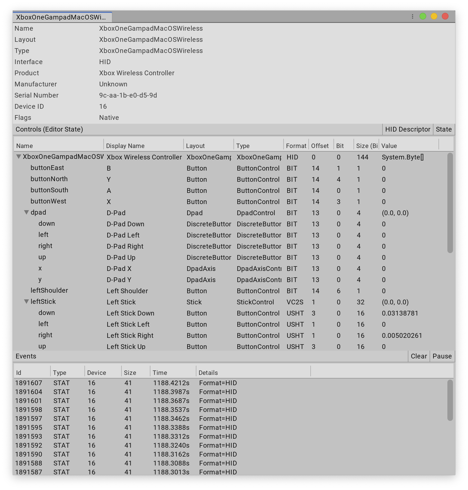
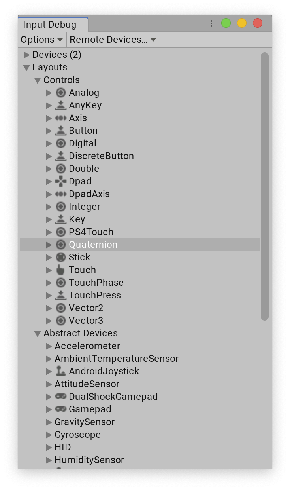
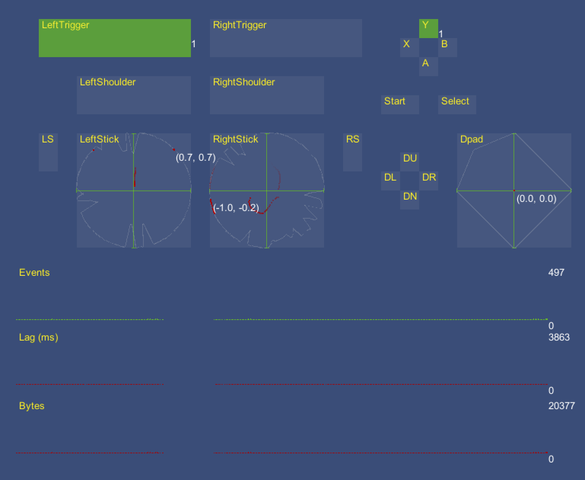
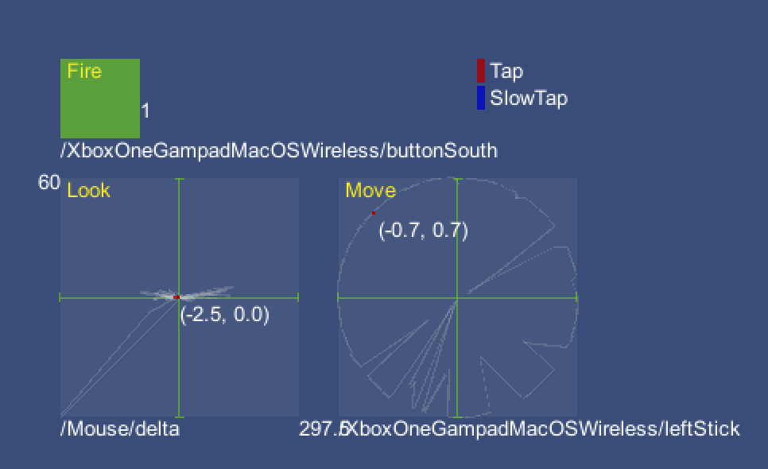

# Debugging

* [Input Debugger](#input-debugger)
  * [Debugging Devices](#debugging-devices)
  * [Debugging Actions](#debugging-actions)
  * [Debugging users and PlayerInput](#debugging-users-and-playerinput)
  * [Debugging layouts](#debugging-layouts)
  * [Debugging Remotely](#debugging-remotely)

When something isn't working as expected, the quickest way to troubleshoot what's wrong is the Input Debugger in the Unity Editor. The Input Debugger provides access to the activity of the Input System in both the Editor and the connected Players.

To open the Input Debugger, go to __Window > Analysis > Input Debugger__ from Unity's main menu.

## Input Debugger

The Input Debugger shows a tree breakdown of the state of the Input System.

|Item|Description|
|----|-----------|
|Devices|[Input Devices](Devices.md) that are currently added to the system as well as a list of unsupported/unrecognized Devices.|
|Layouts|A breakdown of all registered Control and Device layouts. This is the database of supported hardware, and information on how to represent a given piece of input hardware.|
|Actions|Only visible in Play mode and only if at least one [Actions](Actions.md) is currently enabled.  Shows the list of all currently enabled Actions and the Controls they are bound to.  See [Debugging Actions](#debugging-actions).|
|Users|Only visible when there one or more `InputUser` instances exist. See documentation on [user management](UserManagement.md).  Lists all currently active users along with their active Control Schemes and Devices, all their associated Actions and the Controls these Actions are bound to.  Note that `PlayerInput` uses `InputUser` to run. When using `PlayerInput` components, each player has an entry in this list.  See [Debugging users and PlayerInput](#debugging-users-and-playerinput).|
|Settings|Shows the currently active Input System [settings](Settings.md).|
|Metrics|Shows some statics about Input System resource usage.|

### Debugging Devices

Double-click any [input device](Devices.md) in the __Devices__ list in the Input Debugger window to open a window showing information about the Device, including real-time state information for its Controls.

The top of the Device window shows general information about the specific Device such as name, manufacturer, serial number, etc.

Below that, the window lists the Device's Controls and their individual state. This is useful when debugging input issues, as it allows you to verify if the data the Input System is receiving from the Input Device is what you expect it to be. There are two buttons at the top of this panel:

* __State__: Show the current state of the Device in a new window. This is identical to the information shown in this view, but doesn't update in real time, so you can take a snapshop of input state data and take the time to inspect it as needed.

* __HID Descriptor__: Only shown for devices connected using the HID protocol. This opens a window showing the detailed [HID](HID.md) specifications for the Device and each of it's logical controls.

Finally, at the bottom of the window, you can inspect the event stream coming from the Device. This is where Unity shows all [input events](Events.md) generated by the Device. You can double-click any event in the list to inspect the full Device state at the time the event occurred. You can also select multiple events, right click them, and click Compare from the context menu that appears to get a side-by-side difference between the state of the Device at different points in time.

### Debugging Actions

The Input Debugger window lists all enabled [actions](Actions.md) in the __Actions__ list. This list only appears if at least one Action is active and the Editor is in Play mode. If an Action has actively bound Controls, you can click the arrow next to the Action to see a list of the Controls. This is useful to debug whether your Bindings correctly map to the Controls you want them to bind to. See documentation on [Binding resolution](ActionBindings.md#binding-resolution) for more information about how Unity maps Bindings to Controls.

>__Note__: Actions belonging to [`InputUsers`](UserManagement.md) don't appear here. They appear in the [__Users__](#debugging-users-and-playerinput) list instead.

### Debugging users and PlayerInput

When there are any [`InputUser`](UserManagement.md) instances (If you are using `PlayerInput`, each `PlayerInput` instance will implicitly create one), the Input Debugger lists each instance along with its paired Devices and active Actions in the __Users__ list. The listed devices and actions work the same way as those shown in the [__Devices__](#debugging-devices) and [__Actions__](#debugging-actions) lists in the debugging window.

### Debugging layouts

The [__Layouts__](Layouts.md) list in the Input Debugger window shows a breakdown of all registered [Control and Device layouts](Layouts.md). This is the database of supported hardware and the knowledge of how to represent a given piece of input hardware. This is mostly handy when you want to [create a new Device mapping](HowDoI.md#create-my-own-custom-devices), and want to see how it gets represented by the Input System.

### Debugging remotely

You can connect Input Debugger to a Player running on a remote computer or device. This makes input activity from the Player observable in the Editor. The mechanism used by this is Unity's `PlayerConnection`, that is, the same mechanism by which the Unity profiler can be connected to a Player.

>__Note__: At the moment, debugging input in Players is restricted to seeing Devices and events from connected Players. There is no support yet for seeing other input-related data such as Actions and input users from Players.

To see remote Devices from built Players, click the __Remote Devices…__ drop-down list in the Input Debugger window. You will see a list of remote Player instance you can connect to (if there are any) - this is the same list as you will see in the Profiler and Console windows, and any connections are shared between those windows. If any Player(s) are connected, you can enable __Show remote devices__ in the same drop-down list. If Players are connected, and __Show remote devices__ is enabled, the [__Devices__](#debugging-devices) list in the Input Debugger window will be split into a __Local__ section and a __Remote__ section. The __Remote__ section will show any Input Device from any connected Player, and lets you inspect Device state and events in real time, just as if it were a local Device.

## Input visualizers

The Input System package comes with a __Visualizers__ sample, which provides various components which let you monitor the state of various Input System elements in real time using on-screen visualizers.

To install the sample, navigate to the Input System package in the Package Manager window ([see "Installation"](Installation.md)), and click __Import in project__ next to the __Visualizers__ sample.

The sample provides two visualizer components:

### `InputControlVisualizer`

Visualizes the current state of a single Control in real time. You can have multiple Control visualizers to visualize the state of multiple Controls. Check the `GamepadVisualizer`, `MouseVisualizer` or `PenVisualizer` Scenes in the sample for examples.

### `InputActionVisualizer`

Visualizes the current state of a single Action in real time. You can have multiple Action visualizers to visualize the state of multiple Action. Can show the current value of the Action, the Control currently driving the Action, as well as track the state of [Interactions](Interactions.md) over time. Check the `SimpleControlsVisualizer` Scene in the sample for examples.

